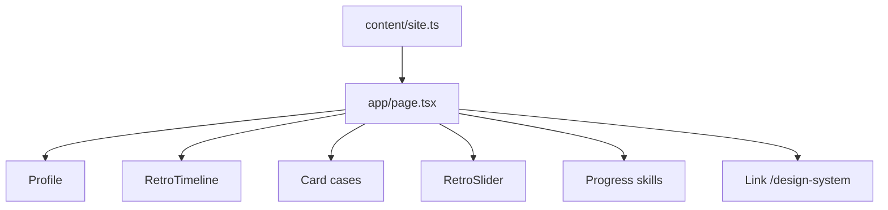

# Portfólio inicial (one-page)

Versão inicial = **só [`app/page.tsx`](app/page.tsx)** vira portfólio. [`/design-system`](app/design-system/page.tsx) permanece showcase interno. Visual = DS já existente (Press Start 2P + Orbitron, neon, `Card` / `Profile` / `RetroTimeline` / `RetroSlider` / `Progress` / `Button`). **Não** reabrir o plano editorial Newsreader/Sora em [`.cursor/plans/site_pessoal_next_ed7dad3d.plan.md`](.cursor/plans/site_pessoal_next_ed7dad3d.plan.md).

Fonte de fatos: [LinkedIn (id 243317183)](https://www.linkedin.com/in/carlos-augusto-miranda-brandão-243317183/) — mesmo perfil que `carlos-augusto-brandão-243317183`. GitHub [Jackie098](https://github.com/Jackie098) só como link (repos de curso, não vitrine).

## Conteúdo (não colar About do LinkedIn)

About público fala “just over a year”; CV tem **~5 anos**. Copy nova em PT-BR, voz ativa, específica.

- **Headline:** `Web Developer | JavaScript | NodeJS | ReactJS`
- **Local:** Floriano, PI
- **Pitch (proposta):** constrói produto web ponta a ponta (React + Node/TypeScript; Django REST quando o back trava o front) e já liderou time quando a entrega precisava de direção.
- **Agora:** ETIPI, time de customização do PiDigital (mar/2024–hoje).
- **Inglês:** EF SET B2 — leitura/docs ok; fala ainda em progresso (honesto).
- **Contato:** `mailto:carlos.aug.developer@gmail.com` (já no plano antigo do repo), LinkedIn, GitHub. Sem fingir Solrus como cliente das empresas do CV.

**Cases (problema → o que fez → prova visível), não grid de 6 cards iguais:**

1. **Datasales** — automação marketing varejo; forms + APIs Facebook/Instagram/WhatsApp/SMS; [datasales.io](https://datasales.io/)
2. **IPdelve / Mercado de Patentes** — front + Django REST + DS + Scrum; [mercadodepatente.com.br](https://mercadodepatente.com.br/about-us)
3. **Lekko** — gateway de pagamentos + lead de 3 devs (sem URL pública)

CEF EAD e IntegraHUB ficam de fora nesta versão (não incham a home).

**Timeline (work + edu):** ETIPI → Lekko → IPdelve (front / lead / fullstack, uma entrada consolidada ou 3 se o componente aguentar sem scroll infinito) → Datasales → monitorias IFPI → ADS IFPI 2017–2022 → GoStack Rocketseat.

**Stack honesta (slider + barras RPG):** JavaScript, TypeScript, React, Node, Serverless/AWS (S3, Lambda, CloudWatch, Route53, RDS), Django REST, Scrum/Jira. Java no repertório (formação/monitoria), sem case Spring de produção.

## Arquitetura

- Novo [`content/site.ts`](content/site.ts): nome, headline, bio, links, `timeline: TimelineEntry[]`, `projects`, `tech: TechItem[]`, `skills` (label + value + variant). Página só monta seções.
- Seções da home (âncoras, coluna única `max-w-5xl`, alinhado à esquerda — não hero centrado atual):
  1. **Chrome:** `SoundToggle` + `ThemeToggle` (padrão atual) + nav âncora curta (Sobre, XP, Cases, Stack, Contato) + link DS
  2. **Hero / title screen:** `Profile` com dados reais (`GithubLink`, `LinkedinLink`, `EmailLink`); `TypingText` com headline; CTA `mailto` + âncora cases
  3. **Sobre:** 1 bloco texto (não About LinkedIn)
  4. **Quest log:** `RetroTimeline`
  5. **Cases:** 3 `Card` (título, org, tags, link externo quando existir)
  6. **Stack:** `RetroSlider` + grid `Progress` (poucas barras, não dump de 80 skills do scrape)
  7. **Contato:** email visível + LinkedIn + GitHub
- Metadata em [`app/layout.tsx`](app/layout.tsx): título/descrição de **portfólio**, não “Design System”.
- Sem rotas novas. Sem libs novas. Tokens só semânticos. Ícones só pixelarticons free.

## Princípios visuais (skill + DS)

- Momento memorável já existe (neon + typing + player fixo): **não** empilhar glitch em toda seção.
- `pb-28` no body: última seção não some atrás do player.
- Light/dark, `prefers-reduced-motion`, teclado, PT-BR.
- Copy: sem “apaixonado por código”; CTAs literais (“Conversar por email”, “Abrir LinkedIn”).

## Verificação

Dev server + browser: home desktop e viewport estreito; âncoras; tema/som; links externos; `/design-system` intacto; contraste e foco.
