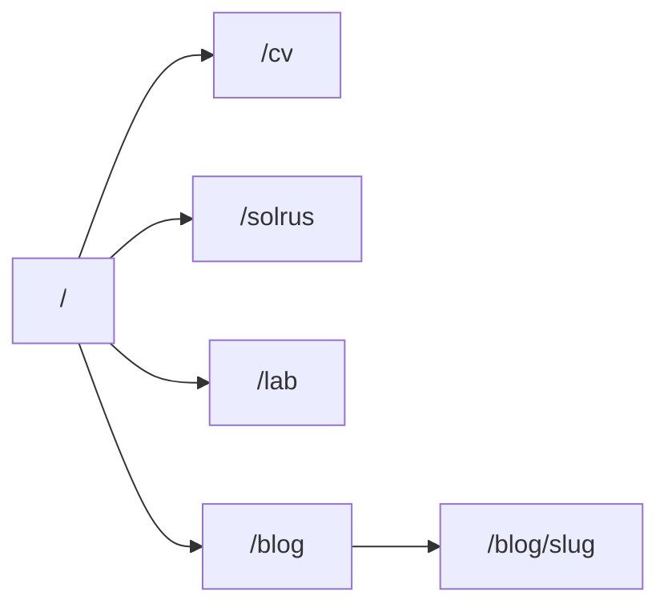

# Site pessoal Carlos Augusto + Solrus Tech

Repo vazio ([package.json](package.json) sem app). Sobe Next do zero. Copy em PT-BR. Conteúdo de [LinkedIn](https://www.linkedin.com/in/carlos-augusto-miranda-brandão-243317183); GitHub ([Jackie098](https://github.com/Jackie098)) só como link — perfil desatualizado, `/lab` fica mínimo neste recorte.

## Mapa de rotas



- **`/`** — pessoa. Uma frase + 3 portas com verbos diferentes + 1 post recente (não 4º CTA).
- **`/cv`** — recrutador. Trajetória, 3 cases com outcome, stack honesta, CTA conversar sobre vaga (`mailto:carlos.aug.developer@gmail.com`).
- **`/solrus`** — cliente. Estúdio **Solrus Tech** (solrac + us). Oferta: produto web, API, integração. CTA pedir proposta (mesmo email).
- **`/lab`** — stub técnico. Stack + GitHub + “repos em revisão”. Sem fingir portfolio open-source atual.
- **`/blog`**, **`/blog/[slug]`** — escrita. Índice tipográfico + 1 post real (setup ou estudo). Tags: `setup`, `tech`, `diario`, `estudo`.

Nav fixo: Carlos Augusto · CV · Solrus · Lab · Blog. Nome da pessoa no wordmark; Solrus é item, não header duplo.

## Brief e copy (não colar About do LinkedIn)

About público está defasado (“just over a year”). Texto novo, voz ativa, específico.

**Frase-raiz (proposta):** constrói produto web de ponta a ponta — React no cliente, Node ou Java no servidor — e já liderou time quando a entrega precisava de direção, não só de código.

**Portas na home**

- Recrutador → `/cv` — “Ver trajetória”
- Projeto → `/solrus` — “Pedir proposta”
- Código → `/lab` — “Ver stack”

**`/cv` — fatos do LinkedIn (sem inflar)**

- ETIPI (mar/2024–hoje): fullstack no time de customização do PiDigital.
- Lekko (dez/2023–mar/2024): gateway de pagamentos + lead de 3 devs.
- IPdelve (2023): front, depois tech lead (sprint/PO/práticas), depois fullstack (Django REST pra não travar o front).
- Datasales (2021–2022): React + Node/serverless/AWS; integrações Facebook, Instagram, WhatsApp, SMS.
- IFPI: ADS 2017–2022; monitor de POO (Java) e programação web (Node).
- Rocketseat GoStack.
- Inglês: EF SET B2 (leitura/docs; fala ainda em progresso — honestidade, não esconder).

**3 cases na página** (problema → o que fez → resultado visível):

1. **Datasales** — automação de marketing varejo; formulários complexos + APIs de mídia; [datasales.io](https://datasales.io/).
2. **IPdelve / mercado de patentes** — front + API Python + design system + Scrum no time; [mercadodepatente.com.br](https://mercadodepatente.com.br/about-us).
3. **Lekko** — gateway de pagamentos e coordenação de 3 pessoas.

Projetos extras (CEF EAD, IntegraHUB) só se couber; não viram grid de cards.

**Stack honesta:** Node/TypeScript/React em produção longa. Java (Spring, Quarkus) no repertório (formação, monitoria, estudo) — listar, não inventar case Spring em produção se o LinkedIn não mostra. AWS (S3, Lambda, CloudWatch, Route53, RDS), Scrum, Jira.

**`/solrus` — oferta (mix)**

Solrus Tech = braço comercial da mesma pessoa. Três linhas, sem jargão:

- Produto web (interface + fluxo).
- API e backend (Node ou Java).
- Integração com ferramenta que o cliente já usa (mídia, mensagem, pagamento, legado).

Prova social = tipo de trabalho do CV, **sem** dizer que Datasales/ETIPI foram clientes Solrus.

**Contato (travado):** [carlos.aug.developer@gmail.com](mailto:carlos.aug.developer@gmail.com). Um campo em `content/site.ts` (`email`). CTAs:

- `/cv` — “Conversar sobre vaga” → `mailto:carlos.aug.developer@gmail.com?subject=Vaga`
- `/solrus` — “Pedir proposta” → `mailto:carlos.aug.developer@gmail.com?subject=Proposta%20Solrus`
- Footer — email visível + LinkedIn + GitHub

**Home + blog:** tom de quem ensina (monitor IFPI, Cais Tech, cultura local). Sem “apaixonado por código”.

## Identidade visual (skill frontend-design)

Pedido: preto/branco como identidade; roxo e azul-claro como acento; claro/escuro; um toque tech. **Não** neon em tudo, **não** kit SaaS shadcn.

**Tokens (4–6)**

- `ink` `#000000`
- `paper` `#F4F5F7`
- `violet` `#4F2F8C` (sério, não glow)
- `ice` `#8EC4D4`
- `mute` `#5C5C66`
- `line` `#D6D6DC`

Escuro: `paper` vira `#000000`, `ink` vira `#F4F5F7`, `line` mais fechada. Violet/ice iguais nos dois temas (acento estável).

**Um momento memorável:** wordmark “Carlos Augusto” em serif grande, alinhado à esquerda. Gradiente violeta→gelo só numa linha fina sob o nome, ou no hover do tema. Resto é tinta e papel.

**Tipo**

- Display: [Newsreader](https://fonts.google.com/specimen/Newsreader) — títulos e wordmark.
- Corpo/UI: [Sora](https://fonts.google.com/specimen/Sora) — grotesk geométrica, não Inter/Geist.

Escala curta, medida &lt; 80ch. Sem palavra isolada colorida no H1, sem eyebrow ALL CAPS, sem `A · B · C`, sem `→` em botão.

**Layout:** editorial, esquerda, coluna única larga o bastante pro CV. Home:

```
Carlos Augusto
frase
Ver trajetória
Pedir proposta
Ver stack

último post — título
```

CV = lista/timeline (aqui número faz sentido: sequência de cargos). Solrus = 3 blocos de oferta, não cards iguais com sombra. Blog = data + título + uma linha.

**Motion:** um reveal no load da home. Sem fade em toda seção. `prefers-reduced-motion`. Toggle claro/escuro (next-themes).

**Shadcn:** primitivos (Button, Separator, Dropdown do tema). Tokens CSS próprios. Sem dashboard, sem card-grid default, sem zinc+radius-lg em tudo.

## Stack e pasta

Next.js App Router + React + TypeScript + Tailwind + shadcn. Páginas estáticas (SSG; `output: 'export'` se o deploy for estático puro).

```
app/layout.tsx          nav, tema, tokens
app/page.tsx
app/cv/page.tsx
app/solrus/page.tsx
app/lab/page.tsx
app/blog/page.tsx
app/blog/[slug]/page.tsx
content/site.ts         email carlos.aug.developer@gmail.com, links, frases
content/blog/*.mdx
components/site-header.tsx
components/site-footer.tsx
components/theme-toggle.tsx
app/globals.css         tokens + temas
```

MDX via `@next/mdx` ou `next-mdx-remote`. Front matter: `title`, `date`, `tags`, `summary`.

SEO: `title`/`description` por rota. Idioma `pt-BR`.

Fora do v1: CMS, i18n, filtro de tag, inventário GitHub, form backend.

## Verificação

Desktop e mobile: home, `/cv`, `/solrus`, `/lab`, `/blog` + post. Troca de tema. Teclado/foco. Estado vazio do blog se só 1 post. Nav e CTA consistentes entre rotas.
